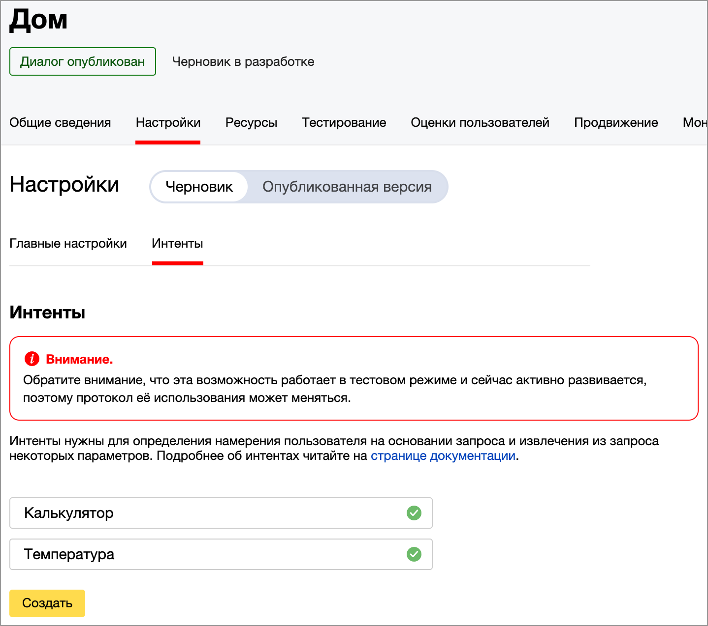
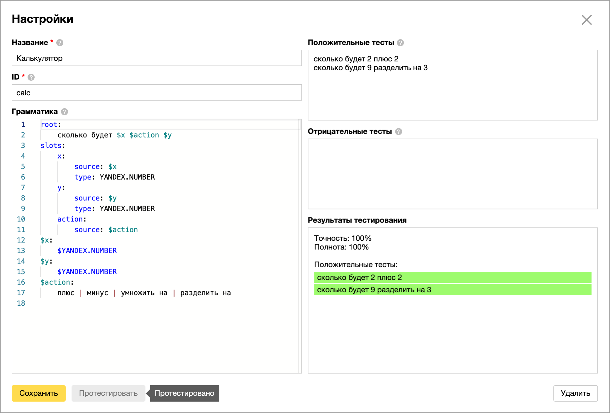
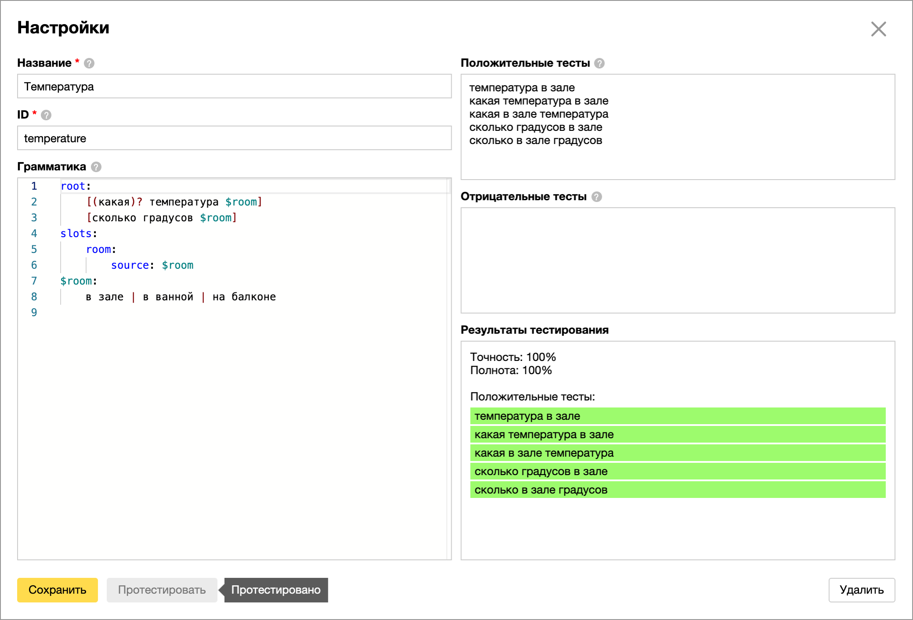

# Управление Home Assistant через Яндекс.Диалоги

[](https://github.com/custom-components/hacs)
[](https://money.yandex.ru/to/41001428278477)

Компонент позволяет управлять [Home Assistant](https://www.home-assistant.io/) из [Яндекс Алисы](https://yandex.ru/alice) через собственный навык в [Яндекс.Диалогах](https://dialogs.yandex.ru/developer).

С помощью Яндекс.Диалогов вы можете настроить реакцию Алисы на абсолютно любые фразы. А не только те, что заложили разработчики. Яндекс Алиса работает на колонках, мобильных приложениях Яндекса и на компьютере в браузере Яндекса.

Неприятной особенностью управления через Диалоги является необходимость называть имя навыка в фразе с командой.

- Алиса узнай у **Дома** температуру в спальне
- Алиса попроси **Джарвиса** включить Ютуб на телевизоре в зале
- Алиса узнай у **Вероники** когда было последнее движение у входной двери

Для работы компонента нужен рабочий внешний доступ к вашему Home Assistant по протоколу HTTPS.

Не стоит путать Яндекс.Диалоги с Умным домом Яндекса. Это разные технологии, не связанные между собой.

## Установка

Устанавливается через HACS или копирование папки компонента в директорию `custom_components` директории конфигов вашего Home Assistant.

## Настройка

Компонент прописывается в `configuration.yaml`.

Если у вас уже работает компонент [YandexStation](https://github.com/AlexxIT/YandexStation) и есть внешний доступ по HTTPS - этот компонент может автоматически создать и настроить навык в Яндекс.Диалогах.

1. Укажите желаемое имя в конфиге и запустите Home Assistant

   **Внимание:** имя приватного навыка должно быть уникальным. Если оно случайно совпадёт с именем существующего навыка - вы об этом не узнаете. В консоли Диалогов ваш навык будет работать, а из Яндекс Алисы - нет. Возможно в Яндексе когда-нибудь это поправят.

   ```yaml
   yandex_dialogs:
     name: Умный дом  # должно быть уникальное имя вашего навыка
   ```

   После запуска в панели уведомлений Home Assistant будет сообщение с ссылкой на ваш навык.

2. Необходимо подождать несколько минут, пока навык опубликуется. Вам на почту прийдёт письмо.

3. Необходимо разрешить доступ на управление вашему аккаунту Яндекса.

   Для этого скажите Яндекс Алисе: `Скажи навыку Умный дом Привет`

   В панели уведомлений Home Assistant должно появится сообщение с ID вашего аккаунта. Пропишите его в конфиге и перезапустите HA:

   ```yaml
   yandex_dialogs:
     name: Умный дом
     allowed_user_ids:
     - ABCDEF01234567890ABCDEF01234567890ABCDEF01234567890ABCDEF0123456
   ```

**PS:** При желании можете самостоятельно создать приватный навык с Webhook на ваш Home Assistant:
- https://myhome.duckdns.org/api/yandex_dialogs

## Примеры управления

Платформа Яндекс.Диалогов позволяет гибко обрабатывать сказанные фразы через [Natural Language Processing](https://yandex.ru/dev/dialogs/alice/doc/nlu-docpage/) (NLU) от Яндекса.

Фраза, которую нужно распознать, называется Интентом. ID интента и все составляющие разобранной фразы прилетят в Home Assistant. И их можно использовать в автоматизациях.

При желании вы можете не пользоваться Интентами, а анализовать фразы в автоматизациях Home Assistant или Node-RED.

### Управление через [Intent Script](https://www.home-assistant.io/integrations/intent_script/)

Существует скрипт по умолчанию `yandex_default`. Он выполняется когда для фразы не совпал ни один Интент.

`action` опциональный. Он выполняется ДО генерации ответа и при желании может на него повлиять.

**Внимание:** у вашего скрипта пара секунд, чтоб вернуть ответ. Алиса дольше не ждёт. Если ваш скрипт выполняется дольше - запускайте его ассинхронно (читайте [документацию](https://www.home-assistant.io/integrations/intent_script/)).

Вам доступны переменные:
- `text` - произнесённая фраза
- `command` - фраза, почищенная от знаков препинания и числетельные преобразованы в числа
- `intent` - если фраза совпала, тут будет ID Интента из Яндекс.Диалогов
- `...` - другие переменные, которые вы прописали в Интенте в Яндекс.Диалогах

```yaml
yandex_dialogs:

intent_script:
  yandex_default:  # это скрипт по умолчанию
    action:  # действие опционально и должно уложиться в пару секунд
    - service: persistent_notification.create
      data:
        title: Команда из Яндекса
        message: "{{ text }}"
    speech:  # фраза для ответа, поддерживает шаблоны
      text: >-
        
          {{ ['слушаю', 'здесь я', 'на связи']|random }}
        
          Температура {{ states("sensor.temperature_bedroom")|round }} °C
        
          Не могу выполнить: {{ text }}
        

  calc:  # это Интент калькулятора (пример как настроить ниже)
    action:
    - service: persistent_notification.create
      data_template:
        title: Яндекс Калькулятор
        message: "{{ text }}"
    speech:  # в нём распознались переменные action, x и y
      text: >-
        
          {{ x+y }}
        
          {{ x-y }}
        
          {{ x*y }}
        
          {{ x/y }}
        

  temperature:  # это Интент температуры в помещении (пример как настроить ниже)
    speech:
      text: >-
        
          Температура в зале {{ states("sensor.temperature_hall")|round }} °C
        
          Температура в ванной {{ states("sensor.temperature_bathroom")|round }} °C
        
          Температура на балконе {{ states("sensor.temperature_balcony")|round }} °C
        
```

### Управление через [автоматизации](https://www.home-assistant.io/docs/automation/) на событиях

**Внимание:** у вас пара секунд, чтоб вызвать событие с текстовым результатом ответа.

Этот подход можно использовать в Node-RED.

```yaml
yandex_dialogs:

automation:
- trigger:
    platform: event
    event_type: yandex_intent  # это событие ОТ вашего навыка
    event_data:
      text: привет  # проверяем точное совпадение с фразой "привет"
  action:
    event: yandex_intent_response  # это наш ответ навыку, нужно уложиться в пару секунд
    event_data_template:
      text: "{{ ['слушаю', 'здесь я', 'на связи']|random }}"

- trigger:
    platform: event
    event_type: yandex_intent
    event_data:
      intent: calc  # проверяем на совпадение с Интентом калькулятора
  action:
  - service: persistent_notification.create
    data_template:
      title: Яндекс Калькулятор
      message: "{{ trigger.event.data.text }}"
  - event: yandex_intent_response
    event_data_template:  # есть все переменные, как и в примере выше
      text: >-
        
          {{ trigger.event.data.x + trigger.event.data.y }}
        
          {{ trigger.event.data.x - trigger.event.data.y }}
        
          {{ trigger.event.data.x * trigger.event.data.y }}
        
          {{ trigger.event.data.x / trigger.event.data.y }}
        
```

### Настройка Интентов в Яндекс.Диалогах

- `$room` - слово с долларом это переменная
- `[...]` - квадрытные скобки означают, что слова могут идти в любом порядке
- `(какая)?` - вопрос означает, что слова может не быть
- `%lemma` - означает режим сравнение без учёта формы слова (например "*включай свет*" приравнивается к "*включи свет*")

Полная [документация](https://yandex.ru/dev/dialogs/alice/doc/nlu-docpage/).

Интенты можно настраивать только после публикации навыка. Любые изменения в интентах требуют новой публикации (занимает пару минут).



### Пример калькулятора



```
root:
    сколько будет $x $action $y
slots:
    x:
        source: $x
        type: YANDEX.NUMBER
    y:
        source: $y
        type: YANDEX.NUMBER
    action:
        source: $action
$x:
    $YANDEX.NUMBER
$y:
    $YANDEX.NUMBER
$action:
    плюс | минус | умножить на | разделить на
```

### Пример тепературы в разных помещениях



```
root:
    [(какая)? температура $room]
    [сколько градусов $room]
slots:
    room:
        source: $room
$room:
    в зале | в ванной | на балконе
```
